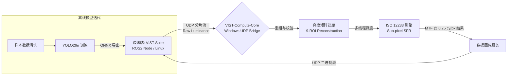
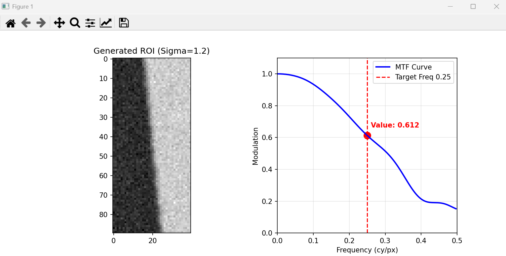

# VIST-Compute-Core: 高性能光学分析与自动化计算节点

**VIST-Compute-Core** 是分布式测试系统 **VIST-Suite** (Vision-Inertial Sensor Testing Suite) 的中央计算中枢。该项目专为高性能 Windows 工作站设计，旨在接管边缘端（如运行 ROS2 的 Ubuntu 虚拟机或嵌入式设备）的计算密集型任务。系统深度集成了 **YOLO 目标检测训练**、**高速 UDP 桥接服务**以及严谨的 **ISO 12233:2023 SFR 算法**，能够对车载级摄像头进行实时、亚像素级的光学解析度分析（MTF）。

## 1. 系统架构 (System Architecture)

系统遵循“端-云”协同的工业测试模式，通过以太网实现数据采集与精密计算的解耦：

## 2. 核心算法验证 (Algorithm Verification)

系统核心计算单元基于 ISO 12233 斜边法（Slanted Edge）。下图展示了系统对模拟生成的ROI 进行计算的反馈结果：

*图：VIST 计算核心生成的 SFR 分析报告。左侧为提取的斜边 ROI（ blur_sigma=1.2, noise_level=0.05 模拟模糊度），右侧为推导出的 MTF 曲线。当前 Target Frequency (0.25 cy/px) 处的调制值为 0.612。*

### 2.1 ISO 12233 光学评估链路

* **亚像素边缘定位**：利用一阶导数重心法精确定位边缘轨迹，克服像素空间量化误差。

* **4倍超采样装箱**：通过重组 ESF（边缘扩散函数），在 1/4 像素维度上重构信号。

* **离散傅里叶变换 (DFT)**：将 LSF（线扩散函数）转换至频域，并应用汉明窗抑制边缘泄露。

## 3. 核心功能模块

### 3.1 高速 UDP 数据桥接服务 (UDP Bridge)

针对跨虚拟机通讯的高延迟问题，设计了基于自定义协议头的非阻塞式接收服务：

* **协议定义**：采用 `0xEE` 作为帧头，结合 `Offset` 与 `Total Length` 实现无序分片的逻辑重组。

* **资源优雅释放**：针对 Win11 环境优化，确保 `Ctrl+C` 信号能触发 Socket 句柄的彻底注销，避免端口残留挂死。

### 3.2 深度学习模型生产线 (YOLO Pipeline)

* **矩形训练策略**：针对工业相机 16:9 画幅优化，提升标靶边缘小目标的检出率。

* **部署闭环**：利用计算端算力完成模型迭代，导出轻量化 ONNX 供边缘端执行毫秒级 ROI 定位。

## 4. 工程化配置参数

| 配置维度 | 参数设定 (Windows Host) | 说明与作用 |
 | ----- | ----- | ----- |
| **IP 地址** | `0.0.0.0` (Binding) | 监听所有网卡，物理 IP 建议固定 |
| **接收端口** | **5005** (UDP) | 接收来自边缘端的原始亮度数据流 |
| **发送端口** | **5006** (Target VM) | 将计算完成的 MTF@0.25 cy/px 结果回传至虚拟机 |
| **超时设定** | `1.0s` (Socket Timeout) | 维持心跳检测，保证主线程对中断信号的响应 |

## 5. 局限性

1. **UDP 协议的非绝对可靠性**：当前仅靠偏移量检查。在工业现场，需要引入 CRC32 校验。

2. **ISP 强行锐化的干扰**：Astra Pro 相机内部的数字增强无法完全关闭，会造成MTF曲线人为抬升，目前采用高斯模糊来对冲。理想测试应基于 Raw 数据进行，这需要更底层的驱动支持。

3. **环境光一致性**：SFR 对光照均匀度极其敏感。建议在恒温、恒光（高显指背光源）的实验室环境下使用。

## 6. 作者信息

* **开发者**：Zhang Lei (上海交通大学 机械工程与自动化专业)
* **资历**：19 年跨国 Tier 1 项目管理与智能摄像头自动化测试开发经验
* **技术方向**：Teststand/LabVIEW/Python 并行自动测试平台架构开发、智能摄像头、计算机视觉、SFR算法、ROS2集成
* **联系邮箱**：<lei.3.zhang@gmail.com>
* **最后更新日期**：2026-02-19
